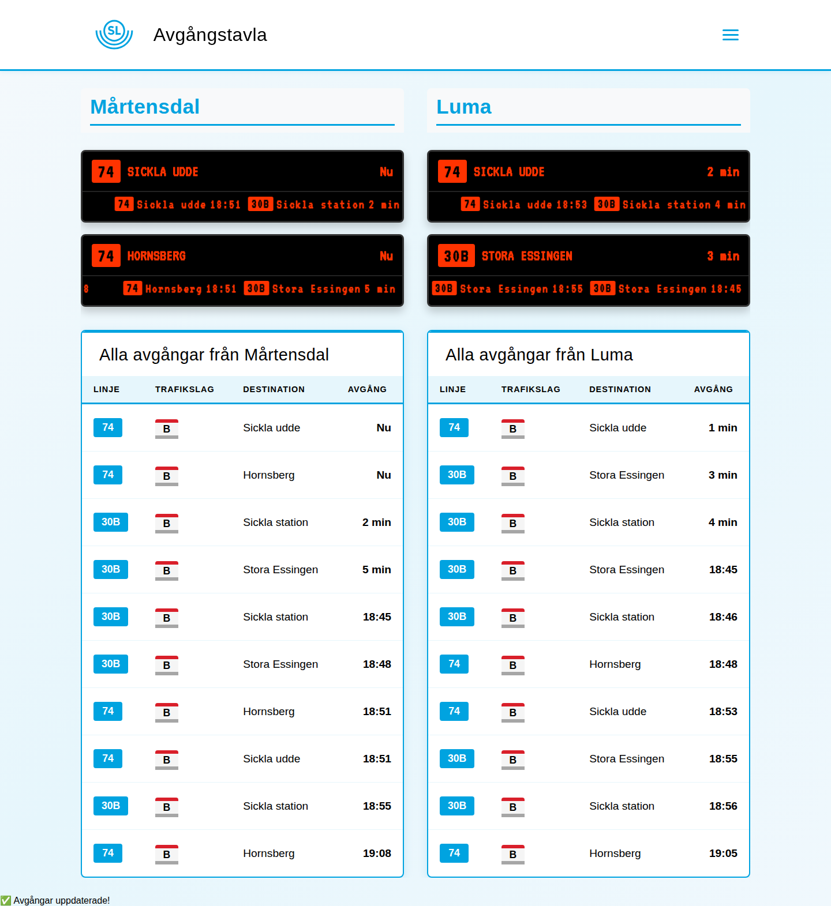
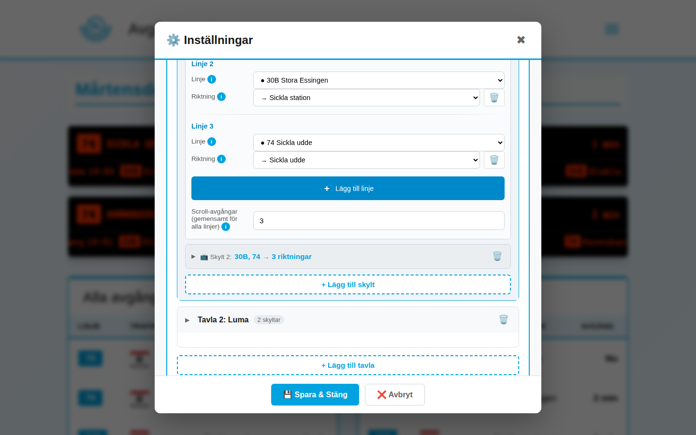

# 🚇 SL Avgångstavla - Digital Signage System

**Realtidsdisplay för Stockholms Lokaltrafik** med autentisk LED-känsla och moderna webbteknologier.

> Det här är ett personligt hobbyprojekt som jag byggt för eget bruk och lagt upp ifall det är till nytta för någon annan. Jag jobbar på det på fritiden, så issues och PR:ar är välkomna men svar kan dröja. Använd på egen risk.


---

## 📸 Skärmdumpar

**Avgångstavlan** — två tavlor (Mårtensdal + Luma) med två riktningsskyltar var plus avgångstabell. Här under Tvärbanans sommaravstängning: ersättningsbuss 30B och buss 74 grupperade per riktning:



**Inställningarna** — skyltar konfigureras med linjefilter och riktning; riktningsvalen visar riktiga destinationsnamn ("→ Sickla udde") istället för abstrakta A/B:



---

## ✨ Funktioner

### 🎯 Multi-Station System
- Visar flera hållplatser samtidigt (t.ex. Mårtensdal + Luma)
- Varje station har egna skyltar med filtreringsmöjligheter
- Dynamisk layout med stationsrubriker

### 🚦 Intelligent Trafikslagsfiltrering
- **Trafikslagsspecifika skyltar** - Separata displayer för Tvärbana, Bussar, etc.
- **Linjefiltrering** - Visa endast specifik linje (t.ex. "Buss 74")
- **A/B Riktningslogik** - Välj destination baserat på alfabetisk ordning

### 🎨 7 Visuella Teman
| Tema | Beskrivning |
|------|-------------|
| **Classic LED** | Traditionell orange LED-känsla |
| **Sci-Fi** | Futuristisk med intensiv glow |
| **E-Ink** | Grå papperskänsla, energisnålt utseende |
| **Retro Terminal** | Grön fosfor, 80-tals CRT |
| **SL Modern** | SL-blå bakgrund, officiell känsla |
| **SL Modern 2** | Vit bakgrund, linjefärger enligt SL:s profil |
| **Art Deco 1920** | 1920-talsstil med mässing och mörkgrön sammet |

### 📊 Real-time Data
- Hämtar live-data från **SL Transport API** via en inbyggd cache/proxy-server
- Klienten uppdateras var 30:e sekund; servern pollar SL smart (30 s–7 min beroende på trafikläge och tid på dygnet)
- **Forecast-fönster**: avgångar hämtas upp till 3 h framåt (styrbart via `SL_FORECAST_MINUTES`, SL:s tak 1200 min) — tavlan går inte tom på kvällar/nätter
- Visar aktuella avgångstider, förseningar och störningsinformation
- **Stale-servering**: vid tillfälliga SL-fel visas senast kända data istället för en tom tavla

### 🖥️ Server & drift
- **Cache/proxy-server** (`api_cache.js`, Node 22 + Express) — en poller per station delas av alla klienter
- **Automatisk klientuppdatering**: servern skickar en versionshash i varje svar; alla skärmar laddar om sig själva inom ~30 s efter en deploy
- **Config-prioritering**: serverns `config.json` är källan — lokalt sparade inställningar (via UI:t) gäller bara tills serverns config ändras
- Endast klientens filer serveras (allowlist); siteId valideras och antalet pollers är begränsat

### ⚙️ Inställnings-UI
- Hamburgarmenyn öppnar ett UI där tavlor/skyltar konfigureras per browser (sparas i localStorage)
- **Riktningsval med riktiga namn**: dropdownen visar "→ Hornsberg" / "→ Sickla udde" istället för "Riktning A/B" — namnen lärs in per station+linje och förbättras ju längre appen kört

---

## 🚀 Snabbstart

Appen kräver Node-servern (klienten hämtar data via `/api/departures/`-proxyn — att öppna `index.html` direkt ger en tom tavla).

### Alternativ 1: Node direkt
```bash
git clone https://github.com/cgillinger/SLskyltapi.git
cd SLskyltapi
npm install
node api_cache.js
# Öppna http://localhost:8200
```

### Alternativ 2: Docker (rekommenderat för drift)
```bash
docker compose up -d --build
# Öppna http://localhost:8200
```
`config.json` volymmonteras read-only — config-ändringar kräver bara omstart av containern, inte rebuild. Kodändringar kräver rebuild (`--build`).

---

## 📁 Filstruktur

```
SLskyltapi/
├── api_cache.js            # Cache/proxy-server (Node/Express, port 8200)
├── index.html              # HTML-struktur + config-laddning
├── app.js                  # Huvudlogik, filtrering, tema-hantering
├── styles.css              # Alla teman definieras här
├── display-renderer.js     # Renderar skyltar (data-attribut för linjefärger)
├── config.json             # Konfiguration (tavlor, skyltar, teman)
├── settings/
│   ├── settings.js         # Inställnings-UI
│   ├── settings.css        # Inställnings-UI styling
│   └── station-search.js   # Stationssökning
├── Dockerfile              # node:22-alpine
├── docker-compose.yml      # Drift (port 8200, config-mount, healthcheck)
├── find_site_id.py         # Python-helper för site-IDs
└── sl_stations.json        # Stationscache
```

---

## 🎨 TEMA-SYSTEM - Komplett Guide

### Översikt

Temat påverkar **endast** `.display-wrapper` (skyltarna). Resten av sidan (header, tabeller, inställningar) är opåverkade.

### Filer som behöver ändras för nytt tema

| Fil | Vad som ändras | Rad (ungefär) |
|-----|----------------|---------------|
| `styles.css` | CSS-definition för temat | Efter sista temat |
| `app.js` | Lägg till i `applyTheme()` | ~470-490 |
| `index.html` | Lägg till i tema-dropdown | ~94-100 |

---

### STEG 1: Definiera temat i `styles.css`

Lägg till **före** kommentaren `AVGÅNGSTABELL - SL-INSPIRERAD WEBBDESIGN`:

```css
/* ═══════════════════════════════════════════════════════════
   THEME: MITT-NYA-TEMA (ENDAST DISPLAY-WRAPPER)
   Beskrivning av temat
   ═══════════════════════════════════════════════════════════ */

body.theme-mitt-nya-tema .display-wrapper {
    --primary-color: #FF3300;           /* Huvudfärg för text */
    --background-color: #000000;        /* Bakgrundsfärg */
    --font-family: 'VT323', monospace;  /* Typsnitt */
}

body.theme-mitt-nya-tema .display-wrapper .departure-content {
    /* Styling för huvudavgångsraden */
    text-shadow: none;
    letter-spacing: 0;
    border: 1px solid #333;
    border-radius: 8px;
    background: var(--background-color);
}

body.theme-mitt-nya-tema .display-wrapper .line-number {
    /* Linjenummerplattan (t.ex. "30") */
    background-color: var(--primary-color);
    color: #000;
    box-shadow: none;
    font-weight: 700;
}

body.theme-mitt-nya-tema .display-wrapper .destination-text,
body.theme-mitt-nya-tema .display-wrapper .time {
    /* Destinationstext och tid */
    color: var(--primary-color);
    font-weight: 500;
}

body.theme-mitt-nya-tema .display-wrapper .scroll-content {
    /* Scrollande avgångar nedtill */
    text-shadow: none;
    color: var(--primary-color);
}

body.theme-mitt-nya-tema .display-wrapper .scrolling-departures {
    /* Bakgrund för scroll-raden */
    background-color: #111;
}

body.theme-mitt-nya-tema .display-wrapper .scroll-line-number {
    /* Linjenummer i scroll */
    background-color: var(--primary-color);
    color: #000;
}
```

#### Tillgängliga CSS-variabler

| Variabel | Användning |
|----------|------------|
| `--primary-color` | Huvudfärg (text, linjenummer) |
| `--background-color` | Bakgrund på skylt |
| `--font-family` | Typsnitt för all text |
| `--scroll-speed` | Scroll-hastighet (sätts via config) |

#### Tillgängliga Google Fonts (redan importerade)

| Font | Stil | Användning |
|------|------|------------|
| `VT323` | Monospace LED | Classic, Retro |
| `Orbitron` | Futuristisk | Sci-Fi |
| `Roboto Mono` | Modern monospace | E-Ink |
| `Share Tech Mono` | Terminal | Retro Terminal |
| `Roboto` | Modern sans-serif | SL Modern |
| `Josefin Sans` | Art Deco | Art Deco 1920 |

Lägg till nya fonts med:
```css
@import url('https://fonts.googleapis.com/css2?family=FONTNAMN:wght@400;700&display=swap');
```

---

### STEG 2: Registrera temat i `app.js`

Hitta funktionen `applyTheme()` (~rad 470) och uppdatera:

```javascript
function applyTheme(theme) {
    const body = document.body;
    
    // Ta bort alla tema-klasser - LÄGG TILL DIN HÄR
    body.classList.remove(
        'theme-classic', 
        'theme-sci-fi', 
        'theme-e-ink', 
        'theme-retro-terminal', 
        'theme-sl-modern', 
        'theme-sl-modern-2', 
        'theme-art-deco-1920',
        'theme-mitt-nya-tema'  // <-- LÄGG TILL
    );
    
    // Lägg till valt tema - LÄGG TILL I LISTAN
    const validThemes = [
        'classic', 
        'sci-fi', 
        'e-ink', 
        'retro-terminal', 
        'sl-modern', 
        'sl-modern-2', 
        'art-deco-1920',
        'mitt-nya-tema'  // <-- LÄGG TILL
    ];
    
    const themeNames = {
        'classic': 'Classic CSS LED',
        'sci-fi': 'Sci-Fi Futuristic',
        'e-ink': 'E-Ink (grå)',
        'retro-terminal': 'Retro Terminal (grön)',
        'sl-modern': 'SL Modern (blå)',
        'sl-modern-2': 'SL Modern 2 (vit)',
        'art-deco-1920': 'Art Deco 1920',
        'mitt-nya-tema': 'Mitt Nya Tema'  // <-- LÄGG TILL
    };
    
    // ... resten av funktionen
}
```

---

### STEG 3: Lägg till i dropdown i `index.html`

Hitta `<select id="setting-theme">` (~rad 94) och lägg till:

```html
<select id="setting-theme">
    <option value="classic">Classic LED</option>
    <option value="sci-fi">Sci-Fi Futuristic</option>
    <option value="e-ink">E-Ink (grå)</option>
    <option value="retro-terminal">Retro Terminal (grön)</option>
    <option value="sl-modern">SL Modern (blå)</option>
    <option value="sl-modern-2">SL Modern 2 (vit)</option>
    <option value="art-deco-1920">Art Deco 1920</option>
    <option value="mitt-nya-tema">Mitt Nya Tema</option>  <!-- LÄGG TILL -->
</select>
```

---

### Avancerat: Linjefärger per trafikslag

För teman som SL Modern 2 kan du sätta olika färger baserat på linje eller trafikslag.

`display-renderer.js` sätter automatiskt dessa data-attribut:
- `data-line="30"` - Linjenummer
- `data-mode="TRAM"` - Trafikslag (TRAM, BUS, METRO, TRAIN)

Använd så här i CSS:

```css
/* Specifik linje */
body.theme-mitt-tema .display-wrapper .line-number[data-line="30"] {
    background-color: #E57622;  /* Tvärbanan orange */
}

/* Alla bussar */
body.theme-mitt-tema .display-wrapper .line-number[data-mode="BUS"] {
    background-color: #A4112C;  /* Buss röd */
}

/* Kombination: Blåbussar */
body.theme-mitt-tema .display-wrapper .line-number[data-line="4"][data-mode="BUS"] {
    background-color: #003E9A;  /* Blåbuss */
}
```

#### SL:s officiella linjefärger

| Trafikslag | Färg | HEX |
|------------|------|-----|
| T-bana Blå (10, 11) | Mörkblå | `#1C2F7A` |
| T-bana Röd (13, 14) | Röd | `#D51427` |
| T-bana Grön (17, 18, 19) | Grön | `#60A42B` |
| Pendeltåg | Grå | `#A4A5A7` |
| Tvärbanan/Spårvagn | Grå | `#A4A5A7` |
| Buss (standard) | Röd | `#A4112C` |
| Blåbussar (1-4, 6) | Blå | `#003E9A` |
| SL Blå (generell) | Cyan | `#008ED7` |
| Störningsfärg | Orange | `#E57622` |

---

### Checklista för nytt tema

- [ ] CSS-definition i `styles.css` med alla selektorer
- [ ] Font importerad (om ny font)
- [ ] Tema-klass tillagd i `body.classList.remove()` i `app.js`
- [ ] Tema tillagt i `validThemes` array i `app.js`
- [ ] Tema tillagt i `themeNames` object i `app.js`
- [ ] `<option>` tillagd i dropdown i `index.html`
- [ ] Testat med Ctrl+Shift+R (hard refresh)

---

## 🛠️ Konfigurationsguide

Begrepp: en **tavla** = en station med avgångstabell; en **skylt** (display) = en LED-sektion i tavlan som filtrerar på linjer/riktning.

### Tavla (station)
```json
"tavlor": [
  {
    "station": { "siteId": "1555", "name": "Mårtensdal" },
    "displays": [ ... ]
  }
]
```

### Skylt (display) — lines-format
En skylt kan kombinera flera linjefilter, vart och ett med egen riktning:
```json
{
  "id": "martensdal-mot-sickla",
  "name": "Mot Sickla",
  "lines": [
    { "lineFilter": "TRAM-*",  "direction": "A" },
    { "lineFilter": "BUS-74",  "direction": "B" }
  ],
  "maxScrollingDepartures": 3
}
```
- `lineFilter`: `"MODE-LINJE"` (t.ex. `"BUS-74"`), `"MODE-*"` (alla linjer av trafikslaget) eller `null` (alla linjer)
- `direction`: `"A"`/`"B"` = alfabetiskt första/andra destinationen för filtret, `null` = båda riktningarna, eller ett exakt destinationsnamn. OBS: A/B bestäms per linje — buss 74:s A är Hornsberg medan spårvagnens A är Sickla
- Det äldre formatet (`transportMode`/`lineDesignation`/`direction` direkt på skylten) stöds fortfarande och kan ligga parallellt med `lines` (externa läsare av configen använder det)

### Theme Configuration
```json
"display": {
  "theme": "classic",
  "scrollSpeed": 8.8,
  "updateInterval": 30000
}
```

### Server-miljövariabler
| Variabel | Default | Beskrivning |
|----------|---------|-------------|
| `SL_FORECAST_MINUTES` | 180 | Tidsfönster framåt för avgångar (max 1200) |

---

## 🔧 Hitta Site ID för en Station

```bash
# Använd Python-script
python3 find_site_id.py

# Eller sök manuellt:
# https://transport.integration.sl.se/v1/sites?expand=true
```

---

## 📊 API-användning

### SL Transport API (uppströms)
**Endpoint:** `https://transport.integration.sl.se/v1/sites/{siteId}/departures?forecast=180`

**Ingen API-nyckel krävs.** Trafiklab anger inga hårda gränser, bara fair use ("not excessive requests") — proxyservern håller anropen nere genom delad polling per station (30 s när en avgång är nära, annars 1–7 min).

### Egna endpoints (proxyservern)
| Endpoint | Beskrivning |
|----------|-------------|
| `GET /api/departures/:siteId` | Cachade avgångar (startar polling vid behov) |
| `GET /api/status` | Serverstatus, version, cache/poller-info |

---

## 🛠 Felsökning

### Teman fungerar inte
1. Verifiera tema-namn matchar i alla tre filer
2. Kontrollera Console (F12) för CSS-fel
3. Hard refresh: `Ctrl+Shift+R`
4. Kolla att CSS-selectorn börjar med `body.theme-NAMN .display-wrapper`

### Skyltarna visar "Inga avgångar"
- Kontrollera `siteId` är korrekt
- Testa `direction: null` för att se alla riktningar
- Verifiera `transportMode` matchar tillgänglig trafik

### Typsnitt visas inte
- Kontrollera att `@import` finns i `styles.css`
- Verifiera font-namn i `--font-family` är exakt rätt
- Testa med fallback: `'FontNamn', sans-serif`

---

## 🗺️ Exempel-stationer

| Station | Site ID | Tillgänglig trafik |
|---------|---------|-------------------|
| Mårtensdal | 1555 | Tvärbana (30), Bussar |
| Luma | 1552 | Tvärbana (30), Buss 74 |
| Gullmarsplan | 9189 | Tunnelbana, Tvärbana, Bussar |
| T-Centralen | 9001 | Tunnelbana, Pendeltåg, Bussar |
| Slussen | 9192 | Tunnelbana, Bussar |

---

## 📝 Changelog

**v3.1.0** (juli 2026 — aktuell version)
- Forecast-fönster: avgångar upp till 3 h framåt (`SL_FORECAST_MINUTES`, SL:s tak 1200 min)
- Automatisk klientuppdatering vid deploy (versionshash + `Cache-Control: no-cache`)
- Serverns config.json prioriteras över localStorage när den ändrats
- Riktningsval i inställningarna visar riktiga destinationsnamn ("→ Hornsberg") via destinationsminne
- Skyltar kan kombinera flera linjefilter med egen riktning per linje (`lines`-array)
- Stale-servering vid SL-fel, race-fixar i polling, minnesläckor tätade, HTML-escaping av API-data
- Statisk allowlist (endast klientfiler serveras), siteId-validering, poller-tak
- node:22-alpine, graceful shutdown
- Nattläget (gles polling 01–05) viker för nära förestående avgång

**v3.0.0**
- Cache/proxy-server (`api_cache.js`): delad polling per station, smart intervall (30 s–7 min), in-memory cache
- Docker-deploy (Dockerfile + docker-compose, healthcheck)

**v2.2.0**
- 7 teman: Classic, Sci-Fi, E-Ink, Retro Terminal, SL Modern, SL Modern 2, Art Deco 1920
- Tema-system med CSS-variabler och data-attribut för linjefärger
- Förbättrad settings-UI med tooltips och visuell gruppering
- Linje- och riktningsfiltrering per skylt
- Linjefärger enligt SL:s designguide i SL Modern 2

**v2.1.0**
- Multi-station system
- Styled linjenummer i scroll
- Font-size baserad responsiv skalning

---

## 📚 Referenser

- [SL Transport API Dokumentation](https://www.trafiklab.se/api/our-apis/sl/transport/)
- [SL Designmanual](https://sl.se) - Officiella designriktlinjer
- [GTFS Format](https://gtfs.org/) - För kartfunktionalitet

---

## 👤 Användning

Detta är ett **privat projekt** för personligt bruk. SL:s varumärken och design tillhör Storstockholms Lokaltrafik.

---

**🚇 Trevlig resa med din digitala avgångstavla!**
